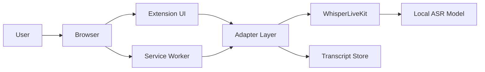
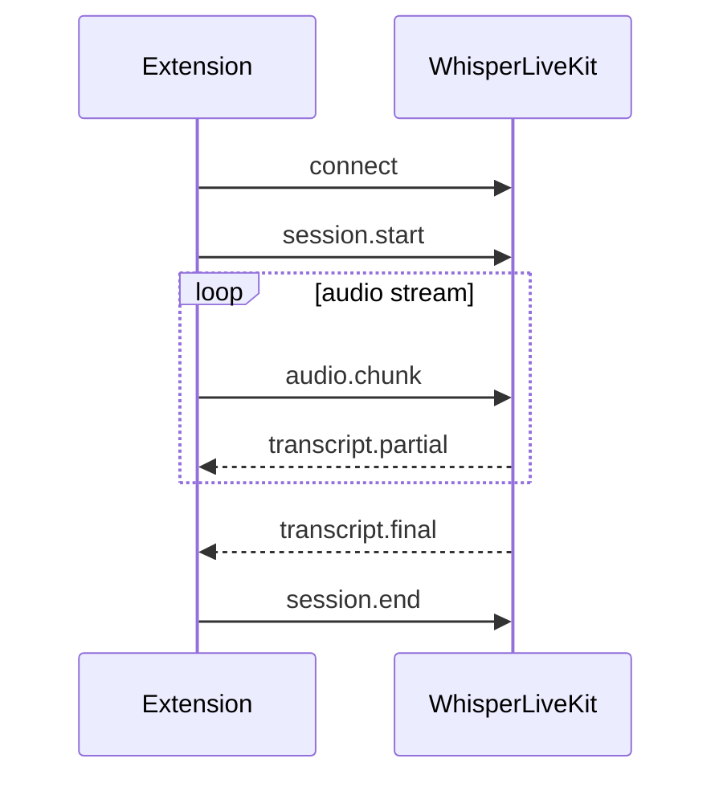
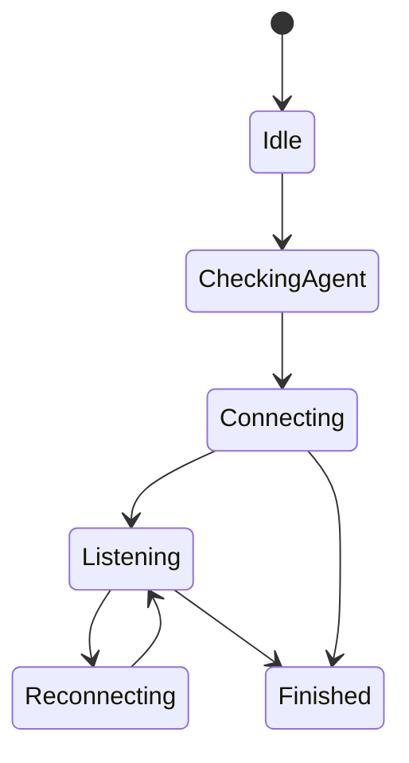

# Architecture Specification

## System Context

```text
Kontur Talk
  -> Chrome Extension
  -> WebSocket
  -> localhost:8000/asr
  -> WhisperLiveKit
  -> Local Whisper model
```

## C4 Container View



## Component Overview

- Popup: entry point, service status, and start/stop control.
- Content script: meeting detection, page integration, and overlay host.
- Service worker: lifecycle, permissions, messaging, reconnect orchestration.
- Overlay: real-time caption rendering.
- Sidebar: transcript history and export actions.
- Adapter layer: normalizes browser events into ASR session calls.

## Extension Architecture

The extension should isolate UI from transport logic. UI components read session state through a narrow message contract. The service worker owns reconnect policy, storage access, and cross-tab coordination.

## WhisperLiveKit Integration

- Transport: WebSocket to `localhost:8000/asr`.
- Payload: PCM audio chunks with session metadata.
- Response: partial and final transcript messages.
- Health: startup probe before enabling capture.

## Adapter Layer

The adapter layer translates browser-specific state into product events.

- Meeting detected
- Agent available
- Audio source ready
- Transcript partial
- Transcript final
- Service unavailable

## WebSocket Protocol



Required fields: `sessionId`, `meetingId`, `timestamp`, `chunkIndex`, `sampleRate`, `channels`, `pcmBase64`.

## State Machine



## Data Model

- Session: meeting identity, start/end times, connection state.
- Segment: partial/final text, timestamp, confidence, source.
- Export: format, generatedAt, record count.
- Health check: endpoint, status, latency, failure reason.

## Storage

- Use local browser storage for lightweight session metadata.
- Keep transient audio buffers in memory only.
- Persist transcript segments only if the product explicitly needs history.
- Never store raw audio unless a future requirement says so.

## Installer

- Detect whether the local ASR service is reachable.
- Explain required permissions before capture starts.
- Provide recovery steps when the service is missing.

## Security

- Local-only network target.
- Minimal extension permissions.
- No telemetry by default.
- Explicit user consent for microphone and tab capture.

## Performance

- Target caption latency under one second.
- Keep reconnect attempts bounded and visible.
- Avoid blocking the UI thread with audio processing.
- Prefer incremental transcript updates over full re-renders.

